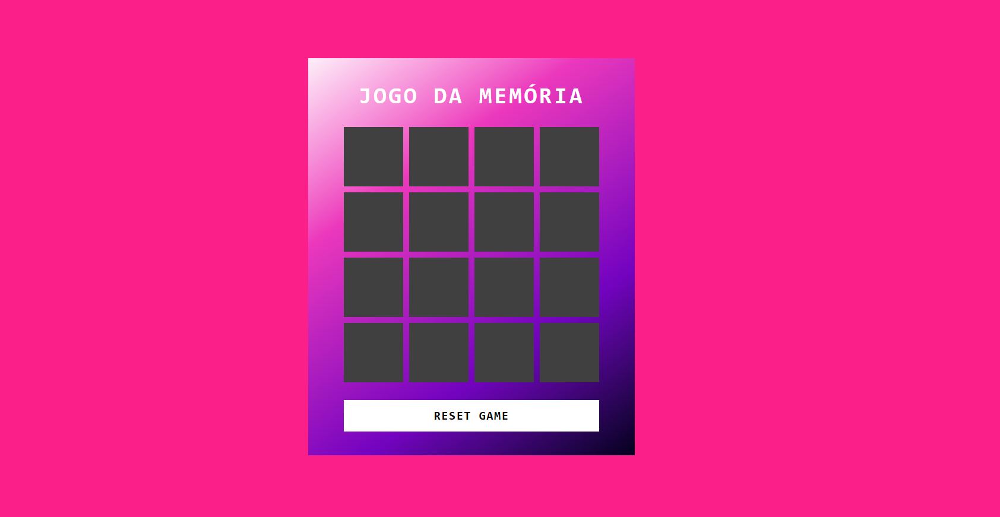

# 🧠 Jogo da Memória com Emojis 🎮

Este é um projeto desenvolvido como parte do **Desafio de Projeto da DIO - Criando um Jogo da Memória com Emojis utilizando JavaScript**. A proposta é aplicar conhecimentos de **HTML**, **CSS** e **JavaScript** para criar um jogo divertido e interativo com o teclado de emojis do Windows.

## 📌 Descrição

O jogo da memória é composto por um grid de cartas com emojis ocultos. O objetivo é encontrar todos os pares correspondentes com o menor número de tentativas possível. Ao encontrar todos os pares, o jogador recebe uma mensagem de parabéns com a opção de reiniciar o jogo.

## 💡 Funcionalidades

- 🔁 Embaralhamento automático das cartas a cada nova rodada
- 🧠 Exibição das cartas ao clicar (virar carta)
- ✅ Verificação automática de par correto
- ❌ Retorno automático caso o par esteja errado
- 🎉 **[NOVO]** Modal personalizado de vitória com botão de **"Reset Game"**
- ♻️ Botão "Reset Game" para reiniciar o jogo a qualquer momento

## 📸 Demonstração

<p align="center" style="display: flex; justify-content: center; gap: 10px;">
  
  
</p>

> 💡 Dica: Use `Windows + .` para abrir o teclado de emojis no Windows!

## 🛠️ Tecnologias Utilizadas

- HTML5
- CSS3
- JavaScript (vanilla)

## 🚀 Como executar o projeto

1. Clone o repositório:
   ```bash
   git clone https://github.com/seu-usuario/jogo-da-memoria-emoji.git

2. Acesse a pasta do projeto:
   ```bash
   cd jogo-da-memoria-emoji

3. Abra o arquivo index.html no seu navegador.

**📁 Estrutura de Pastas**
📦 projeto/
├── index.html
├── src/
│   ├── styles/
│   │   ├── reset.css
│   │   └── main.css
│   └── scripts/
│       └── engine.js

**✅ Desafio da DIO**
🎯 **Objetivo:** Reproduzir passo a passo o projeto visto na aula da plataforma, aplicar os conhecimentos adquiridos e entregar o repositório no GitHub.

🔗 [Link para o desafio na DIO](https://web.dio.me/project/criando-um-jogo-da-memoria-com-emojis/learning/b9abc3c3-bca8-4f8d-850f-0a450d7742cb?back=/track/coding-future-front-end-do-zero&tab=undefined&moduleId=undefined)


**🙋🏻‍♀️ Autora**
Feito com 💜 por Natasha Brandão
@nat_datascience