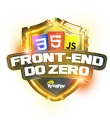

# Ri Happy - Front-end do Zero

    

## Descrição

Participei do bootcamp "Ri Happy - Front-end do Zero", uma jornada de aprendizado que me capacitou a me tornar um desenvolvedor Front-End completo. Durante este bootcamp, tive a oportunidade de construir 10 projetos práticos usando as tecnologias fundamentais: **HTML**, **CSS** e **JavaScript**. O conteúdo foi alinhado com as demandas do mercado e incluía mentorias de especialistas da Ri Happy.

## Objetivos do Bootcamp

- **Dominar HTML, CSS e JavaScript**: Aprendi as tecnologias essenciais para o desenvolvimento web.
- **Construir 10 Projetos Práticos**: Criei páginas web responsivas e dinâmicas, com temas populares como Stranger Things, Spider Man e Yu-Gi-Oh.
- **Destacar meu Portfólio**: Desenvolvi um portfólio impressionante que mostra minhas habilidades a recrutadores do mundo todo.
- **Aprender Princípios de Desenvolvimento Colaborativo**: Entendi como trabalhar em equipe em projetos de software.

## Atividades

Durante o bootcamp, participei das seguintes atividades:

1. **Princípios de Desenvolvimento de Software Colaborativo**
2. **Desenvolvendo minhas Primeiras Páginas com HTML e CSS**
3. **Aprendendo Lógica de Programação**
4. **Dando os meus Primeiros Passos com JavaScript**
5. **Construindo meu Primeiro Portfólio Front-end**

## Tecnologias Utilizadas

    
    
    

## Como Começar

Para iniciar sua jornada no bootcamp:

1. Inscreva-se no bootcamp gratuito [DIO.me](https://www.dio.me).
2. Siga as instruções no portal da DIO para acessar os conteúdos e atividades.
3. Comece a desenvolver seus projetos e aplique os conhecimentos adquiridos!

## Contribuição

Sinta-se à vontade para contribuir com este repositório. Se você tiver sugestões, correções ou melhorias, abra uma *issue* ou envie um *pull request*.

## Contato

Para mais informações ou dúvidas, entre em contato:
- **LinkedIn**: [Natasha Brandão](www.linkedin.com/in/natasha-brandão)
